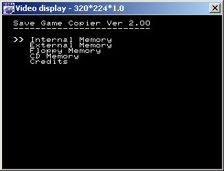
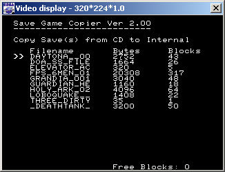
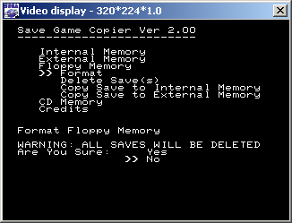

# Save-Game-Copier
Save Game Copier was my entry to the 2003 Segaxtreme Saturn Homebrew contest. It allowed you to burn saves to a CD, boot on a real Saturn, and copy them to the internal memory of the Saturn. I'm uploading the code for archival purposes only as there are better programs to use now. 

# Screenshots

