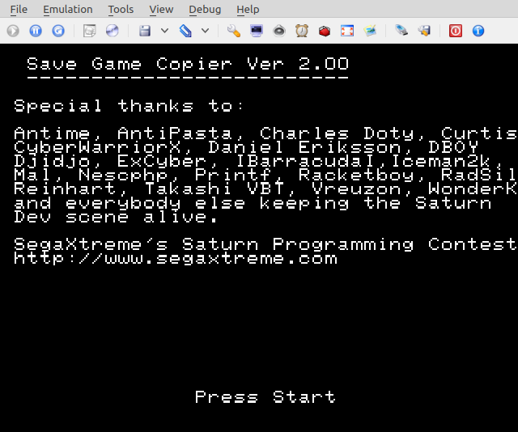

# Save Game Copier Legacy
Save Game Copier was my entry to the 2003 Segaxtreme Saturn Homebrew contest. It allowed you to burn saves to a CD, boot on a real Saturn, and copy them to the internal memory of the Saturn. I'm uploading the code for archival purposes only as there are better programs to use now such as Rockin B's [Save Game Manager](http://www.rockin-b.de/saturn-savegamemanager.html) or my Jo Engine rewrite of [Save Game Copier](https://github.com/slinga-homebrew/Save-Game-Copier).

# Screenshots

